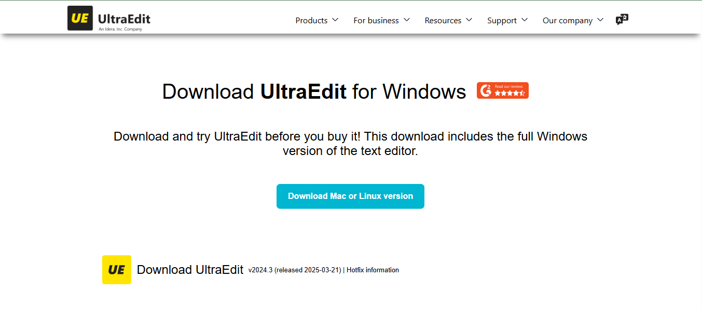
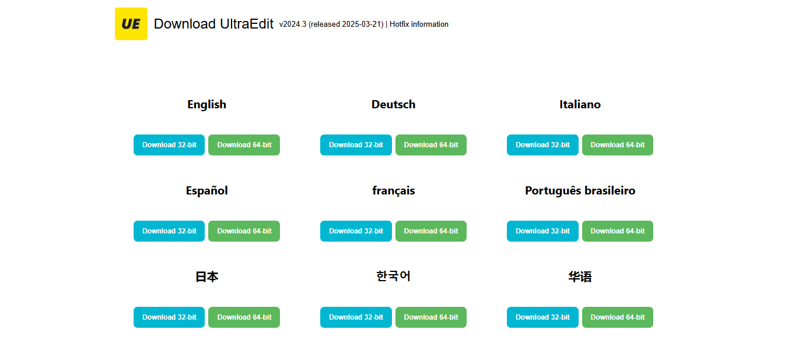
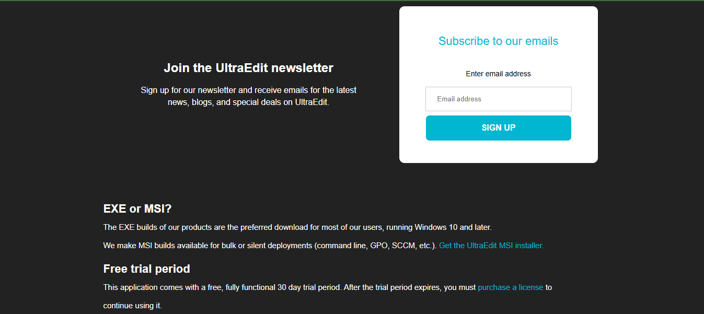
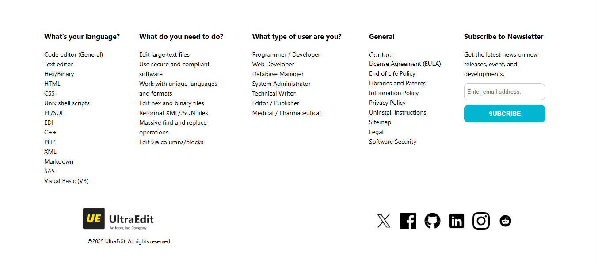

A responsive **UltraEdit Website UI Clone** built with pure **HTML** and **CSS**. This project replicates the design of the UltraEdit website, focusing on layout, typography, and responsiveness. It's a great practice project for improving front-end development skills.

🌟 **Features:**
- Responsive design
- UltraEdit-inspired layout
- Clean and maintainable code

📸 **Screenshot:**  
Below is a screenshot of the UI for reference:  

📂 **Well-Organized Structure:**  
The project is structured with clear and easy-to-navigate sections, making it simple to understand and extend.

🎓 **Ideal for Learning:**  
This project is perfect for beginners aiming to practice and enhance their front-end development skills.

🚀 **Live Demo:**  
[🔗 Visit the Project](https://shouvikmistry.github.io/UltraEdit-UI-Clone/)

---
Feel free to contribute or suggest improvements to make this project even better!